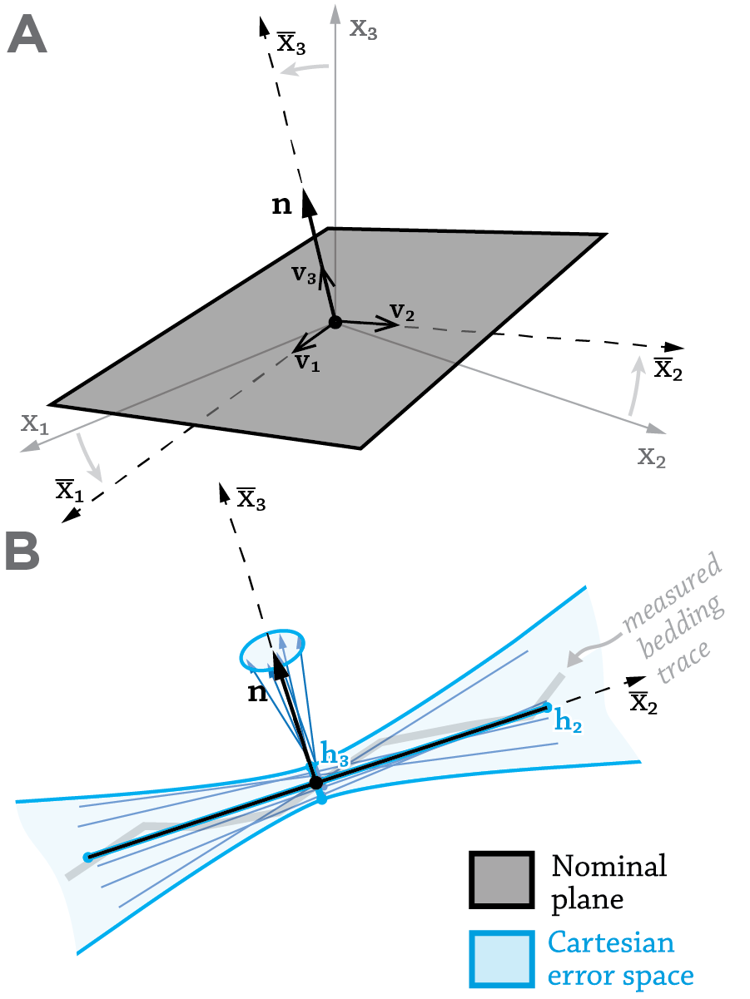
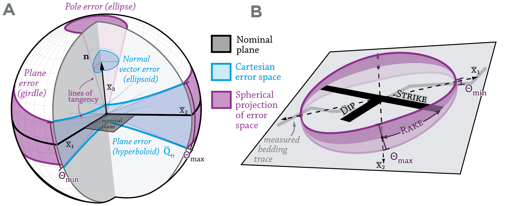

********
Attitude
********

.. Attitude documentation master file, created by
   sphinx-quickstart on Fri Jun  9 03:29:47 2017.
   You can adapt this file completely to your liking, but it should at least
   contain the root `toctree` directive.

Introduction
========

**Attitude** is a Python module for fitting the orientation of planes in
three-dimensional space *with meaningful error distributions*.
This software is the reference implementation of the
statistical method described in `this working paper <https://eartharxiv.org/4enzu/>`_,
currently in review at *Earth and Space Sciences*.

The error-analysis and visualization process developed here is
crucial to creating accurate and consistent representations of geological
orientations from remote-sensing data.
The methodology was developed primarily to support the analysis of
geological orientations from Mars imagery and photogrammetric elevation models,
but it can be applied to any remote-sensing dataset that captures the
three-dimensional linear trace of a planar feature. The method's flexibility
and independence from input view geometry make it particularly suited to
unmanned aerial vehicle (UAV) and ad-hoc structure-from-motion (SfM) datasets.

By default, the method uses principal-component analysis (PCA)
to perform an orientation-independent regression. The Python module also contains
helpers for plotting orientation data on one of several spherical axes.
Several Javascript components, developed in tandem with the Python module, are included to plot error distributions for spherical orientation data.

Contents
--------

.. toctree::
   :maxdepth: 2

   statistical-motivation.rst
   installation.rst
   python-api.rst
   example-notebooks.rst

Usage
=====

The module accepts input in the form of a *n*-by-3 matrix with columns
corresponding to X, Y, and Z coordinates. These data are commonly extracted
from linear or polygonal features on a digital elevation model.

A planar fit can be constructed as such::

  from attitude import Orientation
  measurement = Orientation(array)

Installation
============

Attitude is packaged as a standard Python module. The latest version
is available on PyPI and can be installed using PIP::

   pip install Attitude

If you want to use the development version (which is generally
more up-to-date), you can instead run::

   pip install git+git://github.com/davenquinn/Attitude.git

Contributing
============

Submit an issue on GitHub, or even better, submit a pull request.
We are especially open to implementing new statistical cores.

Indices and tables
==================

* :ref:`genindex`
* :ref:`modindex`
* :ref:`search`

